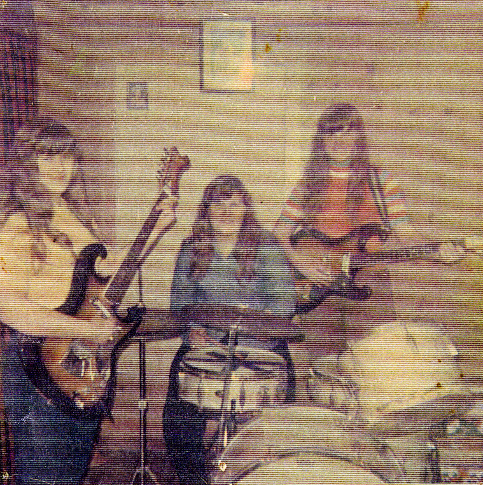

## Art and The Artist

Artists have always existed in fringes of culture. Be it the conspiracy-laden
discussions of "Hollyweird" or the aversion some have towards their local, hair
dye-fueled scenes, artists are oftentimes objectified and isolated
irrespective of the enjoyment of their work. This concept especially thrived
within the somewhat recently formed world of outsider music. The term came into
use as a result of the compilation album, "Songs in the Key of Z," curated by
Irwin Chusid.

> Yet Outsider Music has its place -- an intimate, dimly lit enclave. Songs in
> the Key of Z attempts to air out the dusty attics and damp cellars of the
> greater music community, introducing some of the dizzy aunts and eccentric
> uncles about whom your parents rarely spoke.

Outsider music can be defined as music created by independent artists that
doesn't conform to generally accepted musically standards, in some way. What
distinguishes this from experimental, or avant-garde, music is the fact that
these artists aren't focused on defying societal norms. The music they create is
simply true to them, and they believe that it aligns with other music in the
modern canon. The above quote from Chusid hints at the implications of this, but
doesn't fully expand on the conditions of these artists.

Many artists who would be funneled into the category of outsider music have
severe mental illness, had their success treated like a freak show, and have
been subject to domestic abuse. When presented with this context, Chusid's quote
itself becomes an ethical argument, subconsciously dismissing the realities of
many of these artists. While some artists featured on his compilation are truly,
"dizzy aunts and eccentric uncles," there is an air of flippancy to this
statement when some of the most popular artists on the tape were known to have
faced these adverse conditions.

Since the inception of this concept, many others in the music community have
given their insight on the enjoyment of this genre, and this non-traditional
view of "separating the art from the artist." This report will analyze the
ethical arguments that are made for different artists to further understand the
moral implications of enjoyment.

## Wesley Willis: The Intent of Humor

<iframe width="560" height="315" src="https://www.youtube.com/embed/S2uRv8ZE_Tc" title="YouTube video player" frameborder="0" allow="accelerometer; autoplay; clipboard-write; encrypted-media; gyroscope; picture-in-picture" allowfullscreen></iframe>

Wesley Willis is a rock and roll artist whose music features his lyrics over
keyboard backing tracks. He's notorious for outrageous lyrics about "whupping
Batman's ass," how McDonalds is a place for rock-n-roll, and "the chicken cow."
When meeting fans he would offer them his signature headbutt which resulted in
the consistent bruise in the middle of his forehead. Much of his appeal comes
from the questionably intentioned humor in his music. Before his musical career,
he was diagnosed with paranoid schizophrenia. This muddies the discourse around
Willis' work, as enjoyment of his music became an ethical concern.

The video above attempts to highlight all facets of Willis' public appearance,
highlighting his irreverent demeanor, bizarre song concepts, and attempts to
capitalize on his musical career. The included clips don't include some of his
more expletive-laden songs, or portray him in a demeaning light, presenting a
very neutral and respecting image of him. The existence of this idealistic
portrayal argues that it is morally acceptable to enjoy his music respectfully.
It doesn't allow his mental illness to become the spectacle, but as a result,
ignores the fact that maybe this shouldn't be acceptable at all, even given the
best circumstances.

Some arguments aren't so optimistic. Buddy Seigal argues that the enjoyment of
his work could be unethical while simultaneously, perpetrating stereotypes
towards those with mental illness:

> The demon that Willis speaks of is a voice in his head he calls
> “Nervewrecker.” In conversation, the 33-year-old is largely unresponsive to
> questions, going off into a stream-of-consciousness monologue that can be
> deeply disturbing and is at times indecipherable. He stutters and sputters,
> repeating himself endlessly as he delivers non sequiturs like a mad street
> person; in fact, Willis spent many years homeless, living on the streets of
> Chicago.

His use of "sputters" dehumanizes Willis, mocking his neurodiverse speech
patterns. He also compares him to a "mad street person" and ensures that the
audience knows that he was actually homeless as well. It is difficult to analyze
language surrounding social issues from the past, as things that are perceived
as unacceptable now, could've previously been commonplace. Regardless, this
piece was released within a couple of years of the video, and paints him in a
negative light before an ethical argument is explicitly presented.

> In trumpeting Willis, they seem to be laughing not so much with him as at him,
> in a 'let’s hang out with the retard and have a giggle' display of rank
> insensitivity, mindless pack mentality and rampant egotism. But then, rock
> musicians have seldom been noted for their keen sense of morality, so it’s
> perhaps unreasonable to expect them to examine the motives behind their
> actions. The rest of us are left to ask ourselves what all of this really
> means. Is Willis genuinely better off onstage making a spectacle of himself
> than he would be left to his own devices? Doesn’t he have the same right as
> everyone else to earn a living as he sees fit? If performing brings Willis joy
> and a temporary respite from the torments of 'The Demon,' can his rock ‘n’
> roll sideshow be anything but good?

Seigal continues his questionable rhetoric here, as he begins to analyze the
ethics of enjoying Willis' art. The piece becomes more snide as he questions the
ability of rock musicians to have moral compasses, accusing Willis' band of
taking advantage of him. The inclusion of a slur here is, again, tough to
analyze out of context, but slightly delegitimizes any argument he's making.
Seigal ends the piece with a generic line of questioning that feigns ethical
ambiguity, while his point is clearly made through the language of his piece.

Although Seigal undeniably believes that Willis should not be in the position
that he is in, it seems to come from a place of malice, rather than a serious
consideration of the complications of his mental illness. Seigal even seems to
back this by appealing to the feelings described in Haidt's foundational moral
value of Sanctity and Degradation:

> This foundation was shaped by the psychology of disgust and contamination. It
> underlies religious notions of striving to live in an elevated, less carnal,
> more noble way. It underlies the widespread idea that the body is a temple
> which can be desecrated by immoral activities and contaminants (an idea not
> unique to religious traditions).

Although the details here are not exactly linked to religion, his dehumanization
of Willis, use of crude language, and moral deplatforming of those around him
seem to portray Willis' situation as wholly unethical. Instead of simply
pointing at the audience, Seigal employs this theory to call out the entire
situation as an ethical nightmare.

Regardless, this is an ethical artifact that deserves recognition, as it is reminiscent of the clumsy
mental health discourse in Willis' life. It's actually difficult to find a piece
from this time period published in a major newspaper that doesn't paint Willis'
success or mental illness with disdain.

Stephen Gossett of the Thrillist also considered the morality of enjoying
Willis' work with a bit more time to process. The most resolute of these
considerations occurs in his description of a Wesley Willis tribute night at a
local bar:

> There was little in the way of moral anxiety or fraught spectatorship.
> Thirteen years of distance helps that, so too does our collectively more
> nuanced critical capacity -- an embrace of craft and deliberation that
> complicates narratives of self-taught artists as unstudied, unaware vessels.
> Looking back on Willis’ prolific full-steam-ahead career, his brilliant
> appropriation of brand promotion, and his autonomous artistic cogency, you
> start to feel like he probably reached that breakthrough some quarter century
> ahead of schedule. Rock on, Wes.

Within the same article Gossett ponders the autonomy of Willis, and whether the
fame pushed onto him could've negatively impacted him. That point largely
revolves here as he begins to acknowledge that Willis ultimately loved what he
did and worked hard to make sure that he could continue doing it. He also
contrasts the audience from years ago that requested his music on the radio
while casually using slurs, to those today who genuinely appreciate his art.

Similarities from these positive portrayals of Willis undeniably arise. When
suggesting that it is ethical to enjoy his work, they revere him instead of
demeaning him. This could largely come as a result of the structure of their
position, as it would be unreasonable to praise him while suggesting that people
shouldn't be allowed to do the same. Willis seems to uniformly make people
uncomfortable, independent of ethical arguments, but is an important case to
consider.

## Earnest Pain: Daniel Johnston

<iframe width="560" height="315" src="https://www.youtube.com/embed/3OvWFurOBk8?start=588" title="YouTube video player" frameborder="0" allow="accelerometer; autoplay; clipboard-write; encrypted-media; gyroscope; picture-in-picture" allowfullscreen></iframe>

Daniel Johnston was an Austin-based independent musician, known for his
heartfelt, lofi ballads. He arguably experienced the most fame out of any
Outsider Music artists, as [Kurt Cobain frequently wore a shirt bearing his
art](https://faroutmagazine.co.uk/kurt-cobain-daniel-johnston-t-shirt/). Like
Wesley Willis, Daniel Johnston was diagnosed with schizophrenia and suffered
with mental illness throughout his life. At one point, when flying with his
father, he experienced a psychotic episode and threw the keys of the plane [out
of the window](https://www.irishtimes.com/culture/crash-landing-1.1038523). His
father was luckily able to land the plane, but the effect that mental illness
had on Johnston's life was crippling and constant.

**Daniel Johnston, Peek a Boo**

> You can listen to these songs
>
> Have a good time and walk away
>
> But for me it’s not that easy
>
> I have to live these songs forever
>
> Please hear my cry for help
>
> And save me from myself

However, the argument about the ethics of enjoying his work is a bit more
nuanced than that of Wesley Willis, as Johnston's is critically beloved.
Johnston has varied compositions, has worked with numerous notable artists and
producers, and is oftentimes considered somewhat on the verge of outsider music.
Does it make it more acceptable to listen to him if the music is conventionally
enjoyable, and he isn't some spectacle to be laughed at? Instead, Johnston is
often unwillingly perceived as childlike and somewhat ethereal. David McNamee,
from The Guardian, argues that this perception of him is patronizing, and that
he should be considered the same as any other artist.

> I wonder if people go see him hoping to witness a nervous breakdown,"
> Johnston's friend Gretchen Phillips told music historian Irwin Chusid. "Do
> they perceive him as their equal, or as someone they need to coax along and
> feel safe? As much as the audience may genuinely love his songs, I sense a lot
> of condescension. That's always bugged me.

Provided here is the unique perspective of someone close to Johnston who is
cautious about the audience of his music. Through her questioning, she makes it
clear that she isn't making definitive ethical claims, but instead expressing
concern. She also presents an interesting argument on whether the audience views
him as equal. Society has placed drastically different values on artists
throughout time, ranging from the bottom of the social pyramid, to being
worshiped like gods. Here Phillips questions whether Johnston is furthered
distinguished from other musicians, and ultimately argues that if he is, it's
wrong. Artists can often be objectified to solely be considered entertainment
machines, but to simultaneously further diminish artists with mental health
issues would be especially wrong according to Phillips.

Johnston himself echoes this sentiment:

**Daniel Johnston, Like a Monkey in a Zoo**
> Throw me a peanut
>
> Laugh and make jokes
>
> But I've had enough peanuts and I'm ready to croak...
>
> You say I'm cute
>
> You don't know how much that hurts
>

By calling to the classic comparison of an artist to a circus animal, Johnston
makes his audience aware of his situation, making it clear that his friend's
opinion did have some reality to it. People with mental illness can often be
seen as having a severe lack of agency, but Johnston makes it blatantly clear
that he is aware of the way that some of his audience members perceive him. He
makes an ethical argument on the enjoyment of his own work, which can become a
bit messy. He obviously has the right to make any claim about his experience and
opinion, but whether it can be taken as a legitimate ethical artifact for this
issue is a different question. This idea is also presented in McNamee's article:

> It's often assumed that Johnston's music comes directly as a result of his
> well-documented psychological problems (an extreme, delusion-feeding form of
> bipolar disorder). This isn't true. Yes, his bipolar disorder – now under
> control – has impacted on his music, but not in the way most people assume.
> Johnston lacks the filters used by other songwriters to screen lines that may
> be inappropriate, resulting in an obsessive repetition of his core themes: the
> redemptive power of love, unrequited love, a girl called Laurie. But due to
> the medication he needed to control his mania, Johnston was never even able to
> write or play music while imbalanced. His records don't sound scrawled and
> scratchy because he's mentally ill; they sound like that because they were
> often just recorded in a basement, on a boombox, with a broken chord organ and
> Speak & Spell for accompaniment.

Here, McNamee attempts to disregard the perception of the tortured artist
existing within Johnston. Although he is not directly arguing for or against the
ethics of enjoying his work in this artifact, he is directly addressing his
agency and skill, making it clear Daniel Johnston really is like any other
artist. By arguing that Johnston and his work are not just a product of his
mental illness, McNamee highlights the legitimacy of him as an artist and the
ability for an audience to enjoy his art. His direct language further highlights
this, even though it might delve into presuming too much, as the author isn't in
any place to claim what the different influences on Johnston's work looked like.
This tone makes it clear that the author is very passionate in defending
Johnston, and ensuring that he is presented in a positive and honest light.

Without even making direct ethical arguments around the enjoyment of his work,
the dialogue around Johnston's agency in his career, make clear arguments about
the morals of enjoying his work. He also presents an interesting case study for
outsider music, as the quality is objectively higher than other artists and
therefore creates an entirely different argument on the merit of enjoying him.

## The Shaggs' Involuntary Artistry

<iframe width="560" height="315" src="https://www.youtube.com/embed/XR9d4ESlpHY" title="YouTube video player" frameborder="0" allow="accelerometer; autoplay; clipboard-write; encrypted-media; gyroscope; picture-in-picture" allowfullscreen></iframe>

When the members of the Shaggs, three sisters, were in their adolescence, their
grandmother had a vision that they would grow up to be rock stars. As a result
their father immediately purchased them instruments and forced them into making
music. Having no musical experience, The Shaggs style was incredibly naive. With
bizarre lyrics, offbeat playing, and nonsensical melodies, many would consider
the music complete drivel. It struck with many however, as the formerly
mentioned Kurt Cobain considered it one of his favorite albums, and Frank Zappa
claimed that it was better than the Beatles. This story, like many others in
outsider music is not so simply optimistic. Although the naivety in their music
was refreshing, it was largely a result of their father's abusive behavior
towards them.

In Songs in the Key of Z, Irwin Chusid features rumors that the children were
abused by their father, although details are not available. He pulled them out
of school so that they could spend more time practicing, and as soon as he died,
they stopped performing and making music. They weren't allowed to listen to
music, and couldn't make friends outside their family. Later on, one of the
sisters even alleged that he was "sexually intimate" with her.

Art or music that was created in abusive situations is by no means a novel
concept, but the idea behind outsider music makes it more questionable. If
the art is being enjoyed for how atypical it is, and that factor could partially
be a result of these circumstances, is it ethically right to enjoy it?

In 2016, when the Shaggs' debut (and only) album, Philosophy of the World was reissued, Quinn Moreland reflected on the conditions of the band in a review:

> The Shaggs were forced to make music by a father who physically removed them
> from school. While the Shaggs may have been expressing genuine emotions, it
> was not of their free will. “It’s just something we had to do,” one sister
> recalls in an interview with the BBC. One might consider the anecdote that the
> Shaggs would occasionally sneak away from practice to a nearby lake and then
> rush home as if they had been rehearsing. Calling them outsiders negates the
> trauma that is deeply rooted within their music. Austin emphasized over and
> over how “pure” the Shaggs were, how they were “unaffected by outside
> influences.” But their purity is that of claustrophobia. Outsider artists are
> expected to possess a degree of unconsciousness that acts as a path into the
> profound psyche. But the Wiggin sisters were self-conscious teenagers. Their
> peers tossed soda cans at them. Even though Dot’s lyrics clearly come from a
> significant place within (her adolescent anxieties) the difference is that of
> writing a daily journal to share with a classroom of peers versus writing a
> diary entry before bed.

Moreland takes an interesting ethical position, arguing that the label of
"outsider" itself is harmful in describing the Shaggs. Although this has been
addressed before with some artists, discussing whether they should just be
treated like normal artists, it is even more critical here. When Moreland flips
the purity that their father praised on its head, "But their purity is that of
claustrophobia," it prompts a more conscious argument about the enjoyment of
outsider art. Moreland argues that listening, or not listening, to an artist
because of their troubling circumstances is irrelevant as long as their
situation is treated with respect. This argument reflects utilitarian ideals
like those established Jeremy Bentham in his greatest happiness theorem:

>The creed which accepts as the foundation of morals utility, or the greatest
>happiness principle, holds that actions are right in proportion as they tend to
>promote happiness, wrong as they tend to produce the reverse of happiness. By
>happiness is intended pleasure, and the absence of pain; by unhappiness, pain,
>and the privation of pleasure.

By this argument, the artist can be considered a just ethical figure as they are
creating work with the intention of entertainment. The audience, however, can be
seen as mostly unjust in this regard, especially in the situation of the Shaggs.
Normally an audience would provide greater quality of life to an artist as a
virtuous response to the enjoyment that they received. In this case, the sisters
saw little to no money from the music, and faced more expectations and reminders
of their trauma as a result of their tiny fame. Moreland's showcase of this,
when analyzed with Bentham's theory, could argue that the audience is almost
entirely unethical. He is also painfully aware that this is rarely the case:
"Outsider artists are expected to possess a degree of unconsciousness that acts
as a path into the profound psyche." Is it then more ethical to throw away the
outsider label entirely and simply enjoying things for the virtue of enjoying
them? Does this genre classification, and resulting freak show, cause more issue
than if the ethical debate were not relevant at all?

In perhaps the most concise ethical argument on The Shaggs', Howard Fishman finishes his New Yorker article about their last reunion performance with an anecdote from after the show:

> I asked the Wiggins if at Solid Sound they’d considered playing the music as
> it was meant to be heard—correcting the mistakes on the recording, once and
> for all. Though Dot was surprised and disappointed that Krakow and his
> bandmates had chosen to intentionally play out of tune, “everybody seems to
> like it the way it was,” she said, with a shrug that seemed like surrender.

Krakow was a devout Shaggs fan who went to extreme lengths to perfectly recreate
the feel of the original record. The loosely improvised rhythmic sections were
perfectly transcribed and the same brand and model of cheap guitars they used
were acquired. Dot's response seems to perfectly encapsulate Moreland's argument
about outsider music. The use of the word "surrender" evokes a feeling of
hopelessness. This anecdote acts as a reminder that no matter how troubled and
off-beat the people behind these records are, they are still dynamic beings that
end up being treated as museum exhibits. Unlike other artistry, there is no room
for improvement, or even getting worse, as they are expected to strike lightning
time and time again.

> He described the original album’s brilliance as the chance turn of a
> kaleidoscope revealing beautiful, accidental patterns. Once the kaleidoscope
> turns again, ever so slightly, the beauty is lost.

## Conclusion

When observing more and more artists under the outsider music label, the
classification itself seems to be the most damaging aspect. Although artists in
any position of fame are subject to the vitriol of the public, the expectation
with outsider artists get messy. Although the genre is based on the idea that
its unwilling participants exist solely in the fringes of society, they likely
lead more traditional lives than any artist that could be seen on television. On
top of this, they are expected to maintain a magic that the audience itself
understands is inexplicable. Whether the audience is morally supposed to enjoy
them or not seems irrelevant in the presentation of these artifacts that argue
on the topic. The core in all of them seems to be that these artists should be
treated as real imperfect people that they are.

## Sources

<https://www.keyofz.com/>

<https://www.youtube.com/embed/S2uRv8ZE_Tc>

<https://www.latimes.com/archives/la-xpm-1996-03-16-ca-47808-story.html>

<https://www.thrillist.com/entertainment/chicago/the-life-of-wesley-willis-unusual-chicago-musician>

<https://faroutmagazine.co.uk/kurt-cobain-daniel-johnston-t-shirt/>

<https://www.irishtimes.com/culture/crash-landing-1.1038523>

<https://www.youtube.com/embed/3OvWFurOBk8?start=588>

<https://www.theguardian.com/music/musicblog/2009/aug/10/daniel-johnston>

<https://www.youtube.com/embed/XR9d4ESlpHY>

<https://moralfoundations.org/>

<https://www.investopedia.com/terms/u/utilitarianism.asp>
